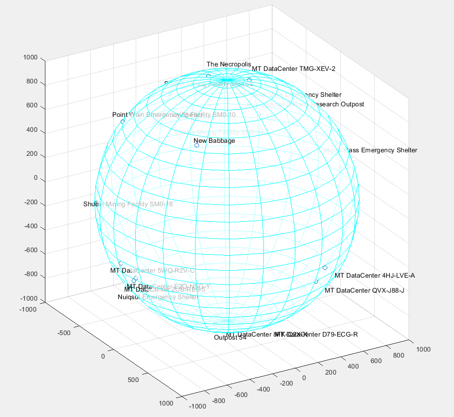

## Be an Astronomer in StarCitizen!
* Make accurate dynamic model for planets.
* Make world clocks and calenders for all planets.
* Make accurate maps for planets surface, including hidden locations.

## Want to help?
* Simply fly to OM1-OM6 and turn on Quantum Drive to measure distances to different locations and add them to the files.
* With a triangulation program, the coordinates of the locations will be calculated. Each location needs at least 4 distances.

A draft map for MicroTech

