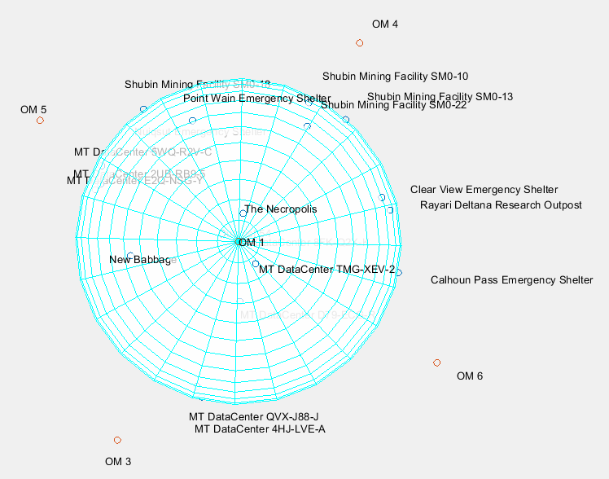

## Be an Astronomer in StarCitizen!
* Make accurate dynamic model for planets.
* Make world clocks and calenders for all planets.
* Make accurate maps for planets surface, including hidden locations.

## Want to help?
* Simply fly to OM1-OM6 and turn on Quantum Drive to measure distances to different locations and add them to the files. Note that you have to fly exactly to the OM points (within meters) after the quantum travl.
* With a triangulation program, the coordinates of the locations will be calculated. Each location needs at least 4 distances.

A draft map for MicroTech

## Camera Settings
* Camera view angle: 90° (screen width)

## Todo
* View angle from inside and outside of the ship looks slightly different! Figure out the exact angle for each.
* get super high resolution 2D maps of all planets, this will be amazing
